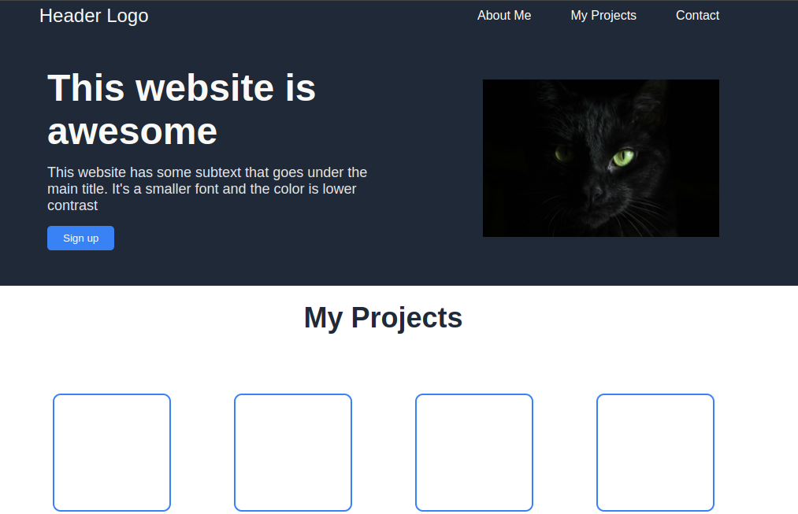

# Landing Page

A sleek, responsive landing page built with pure HTML and CSS. This project showcases strong layout fundamentals, UI structure, and modern design practices.

---

## Features

- **Hero Section** with bold headline and CTA button  
- **Feature Cards** for illustrations or content highlights  
- **Testimonial Section** with quote and attribution  
- **Call-To-Action Block** with centered button  
- **Footer** for branding or extra links  
- **Responsive Design** (mobile-ready with media queries)

---

## Built With

- HTML5  
- CSS3 (Flexbox, custom styling)  
- Google Fonts (Roboto)

---

## Sections Breakdown

| Section | Description |
|--------|-------------|
| **Header** | Logo and navigation links |
| **Hero** | Big title, subtext, and CTA button |
| **Projects** | 4 visually styled placeholder cards with text |
| **Quote** | Centered testimonial block with quote styling |
| **Call to Action** | Blue CTA box with button |
| **Footer** | Dark footer with centered text |

---

## To-Do / Improvements

- [ ] Add actual illustrations or images to cards  
- [ ] Enhance accessibility (ARIA roles)  
- [ ] Add smooth scrolling or animations  
- [ ] Convert to a reusable template or React component  

---

## 🤝 Let's Connect

If you liked this project, have feedback, or want to collaborate — don't hesitate to reach out!

